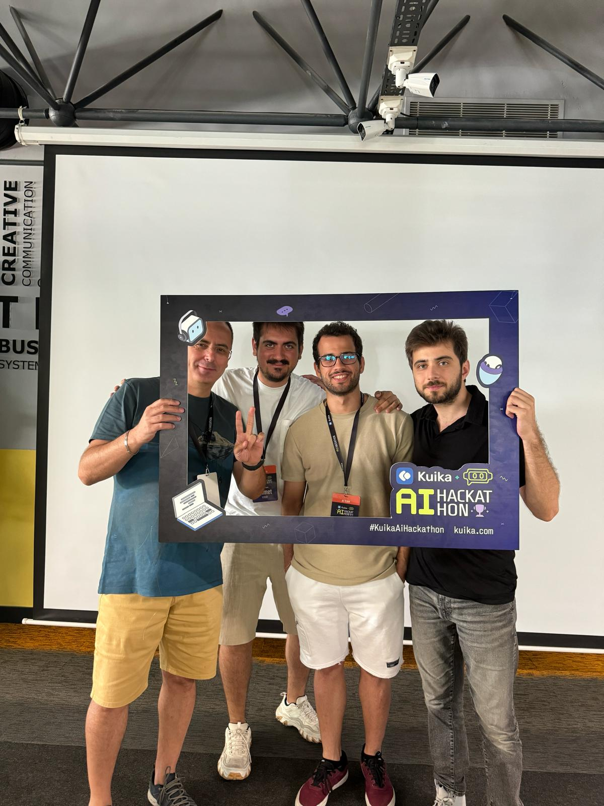
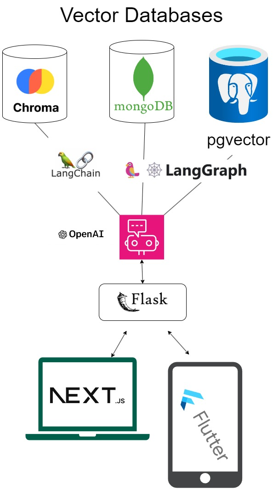

In this AI Hackathon conducted by Kuika, we had 24 hours to create something innovative. We developed a chatbot that assists the company in various areas, 
including data interpretation and analysis, particularly for production data.
The chatbot also provides information on personal leave entitlements, service details, and general documents such as PDFs, Word files, and PPTX presentations.

As part of our software architecture, we employ Flask as the API framework to facilitate seamless communication between our 
Flutter mobile applications and Next.js web interfaces. For our vector databases, we utilize Mongo Vector Search, ChromaDB, and Pgvector, ensuring efficient and scalable data retrieval.
To guarantee robust and reliable connections, we implement **LangChain and Langraph technologies**, enhancing our system's overall performance and integration capabilities.

These are our plans according to the timeline. We developed our product gradually, focusing on continuous optimization. Consequently, 
we paid close attention to our plans and strategies to ensure the product operates efficiently and effectively.

Ultimately, we integrated this intricate graph structure with Next.js for seamless server-side rendering and Flutter for cross-platform mobile development, 
ensuring enhanced performance and user experience.

For more detailed information or inquiries, feel free to reach out to us via email at halil7hatun@gmail.com or ensarcitak1@gmail.com.  

Stay inspired and goodbye for now!